# 线程创建的三种方式

### Thread类：继承Thread类；实际上Thread就是实现了Runnable接口。

##### 完成多线程的三种方式：1. 继承thread类；2. 重写run方法；3. 调用start；

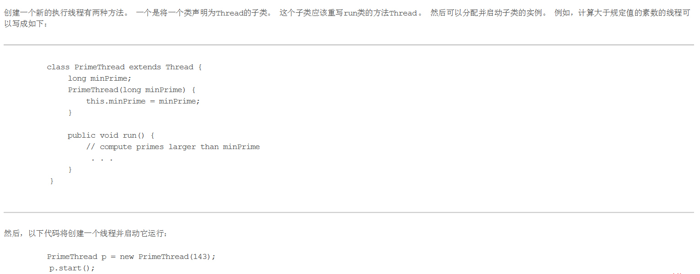

### Runnable接口：实现Runnable接口

##### 完成多线程方式：1. 实现Runnable接口；2. 重写run方法；3. 创建Thread实例传入Runnable接口的实现类并且调用start方法；

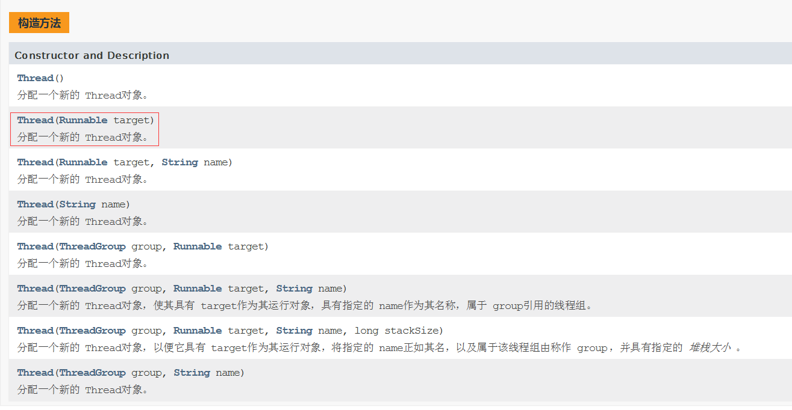

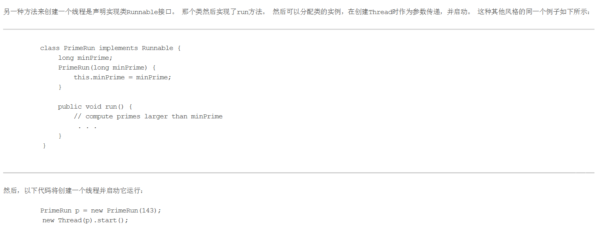

### Callable接口：实现Callable接口

1. 实现callable接口，需要返回值类型
2. 重写call方法，需要跑出异常
3. 创建目标对象
4. 创建执行服务：ExecutorService ser = Executors.newFixedThreadPool(1)
5. 提交执行：Future<Boolean> result = ser.submit(t1)
6. 获取结果：boolean r1 = result1.get()
7. 关闭服务：ser.shutdownNow()

##### TestThread01.java

程序中调用分别取调用了start方法，可以发现子线程和主线程是同时进行的。一个时间片内只有一个线程在工作，调度有CPU来执行。但是如果直接调用run方法可以发现限制性了run方法，在执行了主线程。这个就是程序的顺序执行，没有涉及多线程的概念。

##### TestThread02.java

开三个线程，每个线程去下载图片。可以看到三个线程下载同一张图片的顺序并不是默认的顺序。这也符合在01中的说法。

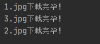

###### 首先有个主观的感受，Thread中肯定有一个run方法，然后我子类继承Thread，然后调用start方法，Thread中肯定有一个run方法，然后父类中的start方法肯定是调用了run方法，然后子类重写了run方法，然后就会去调用子类的run方法。打开源码看一下：

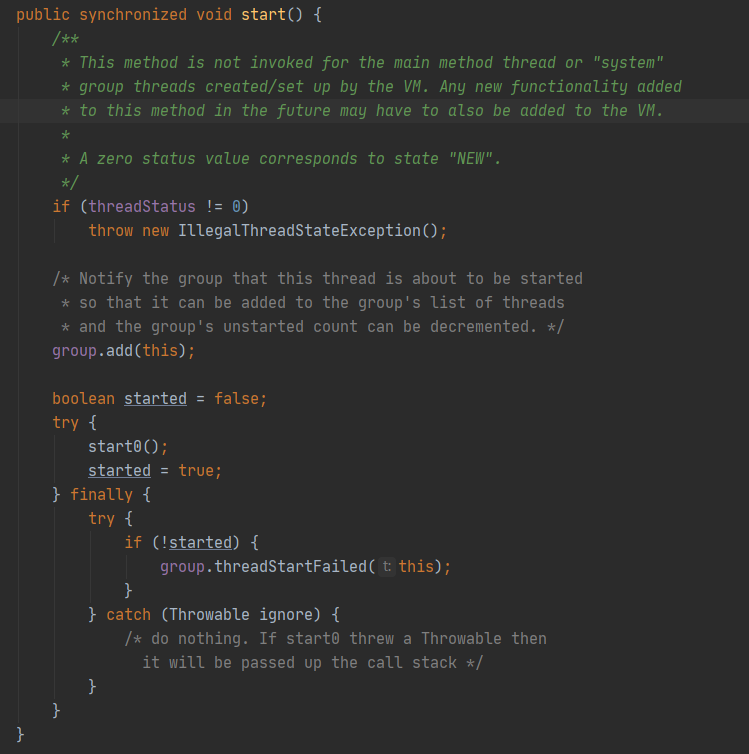

注释的意思为：这个方法不会被主线程或者有虚拟机创建、设置的系统组线程所调用。将来可能还必须将所有添加到此方法的新功能添加到虚拟机。

可以看到start方法中并没有调用run方法。可以看到它调用了一个start0方法：

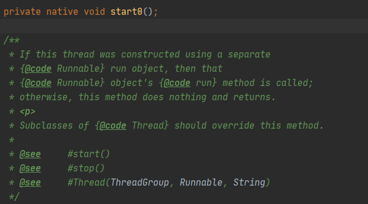

注释的意思为：

###### 如果此线程是实现了Runnable接口调用这个方法的，接下来实现Runnable接口的对象的run方法将会被调用。否则该方法不会执行任何操作并返回。

意思很明显了，我的子类继承了Thread，子类调用start方法，子类没有start方法，父类Thread有start方法，然后执行start方法，执行到start0的时候，根据提示再回去Thread的run方法，子类重写了run方法，于是再回去调用子类的run方法。Thread实现多继承的三部曲就是这样子完成的。

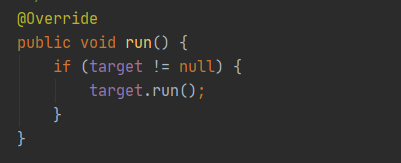

##### TestRunnable01.java

同TestThread01.java一样的逻辑。

看一下源码：

可以看到Thread.java也是实现Runnable方法的：

Runnable接口中run方法需要去实现：

其实用Runnable去实现多线程的方式和Thread方式是类似的。实现Runnable的run方法，然后再通过Thread构造一个线程，再去调用start方法即可完成多线程。本质上还是上面Thread分析的结果。

##### TestRunnable02.java

用实现Runnable接口的方式来做了从网上下载图片的例子。

##### 小结：

###### 继承Thread类：

1. 子类继承Thread类具备多线程能力
2. 启动线程：子线程.start()方法
3. 不建议使用：避免OOP单继承的局限性

###### 实现Runnable方法

1. 实现Runnable接口具有多线程能力
2. 启动线程：传入目标对象 + Thread对象.start()
3. 推荐使用：避免单继承局限性，灵活方便，方便同一个对象被多个线程使用

##### TestThread4.java

发现问题：多个线程操作同一资源情况下，线程不安全，数据紊乱。

##### Race.java

实现了龟兔赛跑的例子

##### TestThread5.java

了解即可。实现Runnable接口的方式用的更多一点。

##### StaticProxy.java 

静态代理模式：

1. 真实对象和代理对象都要实现同一个接口
2. 代理对象要代理真实角色

这部分代码就是在模拟类实现Runnable接口实现多线程的方式。可以看到，WiseMove类和WeddingCompany都实现了Marry这个接口。然后也都实现了marry方法。为了加以区分。这边没有直接在WeddingCompany中直接调用子类的marry方法，而是加上了before和after，这样可以观察的更直白，也更能体会静态代理模式的优势。

好处：

1. 代理对象可以做很多真实对象做不到的事情
2. 真实对象专注于做自己的事情

##### lambda表达式

函数是接口：

1. 任何接口，如果只包含一个抽象方法，那么它就是一个函数式接口

   public interface Runnable(){

   ​	public abstract void run();

   }

2. 对于函数式接口，我们可以通过lambda表达式来创建该对象的接口

为什么要使用lambda表达式？

1. 避免匿名内部类定义过多
2. 可以让你的代码看起来很简洁
3. 去掉一堆没有意义的代码

##### TestLambda.java

程序中有一个Like接口，只有一个抽象方法。所以他是一个函数式接口。可有如下方式实现这个接口

1. 外部类实现接口
2. 静态内部类实现接口
3. 局部内部类实现接口
4. 匿名内部类实现接口（这个在JDBC中讨论过的，接口 x = new 接口(){}; 实际上是创建了一个匿名内部类）
5. jdk1.8新特性，lambda表达式。因为是一个函数是接口，所以只需要在大括号中写接口的实现，然后再去调用接口中的方法名即完成了调用。

##### 线程的一些其他方法：

Thread.sleep() ：线程休息方法；

Thread.yield()：线程礼让方法；当前线程主动放弃时间片，回到就绪状态，竞争下一次时间片

Thread.join()：合并线程，待此线程执行完毕后，再执行其他线程，其他线程阻塞

##### 线程的状态

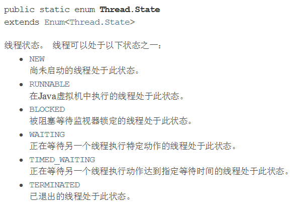

线程状态之间的变化为：

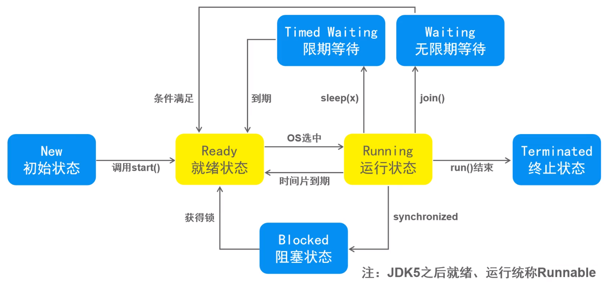

##### 线程优先级

java提供了一个线程调度器来监控程序中启动后进入就绪状态的所有线程，线程调度器按照线程优先级决定应该调度哪个线程来执行。

线程优先级用数字范围1~10来表示

Thread.MIN_PRIORITY = 1;

Thread.MAX_PRIORITY = 10;

Thread.NOR_PRIORITY = 5;

使用一下方式改变或获取优先级：

getPriority(); setPriority();

注意：并不是越高就限制性，而是占的权重大；

TestThreadPriority.java

可以看到主线程的优先级虽然是5，但是总是最先运行完成的。其他的线程结果层次不齐，每一次都不一样。说明优先级只是加权，并不是一定谁先运行。

##### 守护线程

1. 线程分为用户线程和守护线程
2. 虚拟机必须确保用户线程执行完毕
3. 虚拟机不用等待守护线程执行完毕
4. 如，后台记录操作日志，监控内存，垃圾回收等待

TestThreadDaemon.java

可以看到守护线程是死循环，但是用户线程执行完毕之后，虚拟机关闭之后，守护线程也就自动关闭了。

##### 线程同步问题

TestThread4.java的问题还没解决呢？

处理多线程问题是，多个线程访问同一个对象，并且某些线程还像修改这个对象，这个时候我们就需要线程同步。线程同步其实就是一种等待机制，多个需要同时访问此**对象的线程**进入到这个对象的等待池行程队列，等待前面线程使用完毕，下一个线程再使用。并且为了保证安全性，还会给正在操作的队列上把锁，知道该队列完成处理。

由于同一进程的多个线程共享同一块存储空间，在带来方便的同时，也带来了访问冲突问题，为了保证数据在方法中被访问时的正确性，在访问时加入**锁机制 synchronized**，当一个线程获得对象的排它锁，独占资源，其他咸亨必须等待挂起，使用后释放锁即可。存在以下问题：

1. 一个线程持有锁会导致其他所有需要此锁的线程挂起
2. 在多线程竞争下，加锁，释放锁会导致比较多的上下文切换和调度延时，引起性能问题。
3. 如果一个优先级高的线程等待一个优先级低的线程释放锁，会导致优先级倒置，引起性能问题。

TestUnsafeCollection.java可以看到线程不安全的集合。注：当两个线程同时添加的时候会出现覆盖的情况。

多线程安全问题：

当多线程并发访问临界资源，如果破坏了原子操作，可能会造成数据不一致。

临界资源：共享资源（对于同一个对象），一次仅允许一个线程使用，才可以保证其正确性。

原子操作：不可分割的多步操作，被视为一个整体，其顺序和步骤不可打乱或缺省。

##### 同步方法 synchronized：

synchronized关键字包括两种用法：synchronized方法和synchronized块。synchronized方法控制对“对象”的访问，每个对象对应一把锁，每个synchronized方法都必须必须获得调用该方法的对象的锁才能执行，否则线程会阻塞。方法一旦执行，就独占该锁，直到该方法返回才释放锁，后面被阻塞的线程才能获得这个锁，继续执行。缺陷：若将一个大的方法申明为synchronized将会影响效率。

TestUnsafeTicket.java / TestUnsafeBank.java / TestUnsafeCollection.java

三个程序测试了添加synchronized方式：

第一个程序同步的是buy方法，那么三个线程会去一次调用buy方法，直到ticket小于0的情况。这样就实现了同步。

但是第二个程序如果同步run方法，还是同步不了，因为synchronized默认监视的是this，并没有监控的account，所以要注意。

第三个程序同第二个程序。

同步块：synchronized(obj){}

Obj称为同步监视器

1. obj可以是任何对象，但是推荐使用共享资源作为同步监视器
2. 同步方法中无需指定同步监视器，因为同步方法的同步监视器就是this，就是这个对象本身，或者说是class。[反射]

同步监视器的过程：

1. 第一个线程访问，锁定同步监视器，执行其中代码
2. 第二个线程访问，发现同步监视器被锁定，无法访问
3. 第一个线程访问完毕，解锁同步监视器
4. 第二个线程访问，发现同步监视器没有锁，然后锁定并访问

##### TestJUC.java

演示了JUC包下的安全类型的集合

##### 死锁

多个线程各自占有一些共享资源，并且互相等待其他线程占有的资源才能运行，而导致两个或者多个线程都在等待对方释放资源，都停止执行的情景。某一个同步块同时拥有两个以上对象的锁时，就可能会发生死锁的问题。

产生死锁的四个必要条件：

1. 互斥条件：一个资源每次只能被一个进程使用
2. 请求与保护条件：一个进程因请求资源而阻塞时，对已获得的资源保持不放
3. 不剥夺条件：进程已获得的资源，在未使用完之前，不能强行剥夺。
4. 循环等待条件：若干线程之间形成一种头尾相接的循环等待资源关系。

##### Lock锁：

TestLock.java

注意lock.lock()和lock.unlock()的位置

synchronized和Lock的对比：

1. Lock是显示的锁，手动开启锁和关闭锁。synchronized是隐式锁，除了作用域自动释放

2. Lock只有代码块锁，synchronized有代码块锁和方法锁

3. 使用Lock锁，jvm将花费较少的时间来调度线程，性能更好。并且具有更好地扩展性（提供更多的子类）

4. 优先使用顺序：

   ​	Lock > 同步代码块 > 同步方法 

线程通信：

public final void wait();

必须在对对象加锁的同步代码块中调用。在一个线程中，调用wait方法时，此线程会释放其拥有的所有锁标记。同时此线程阻塞在对象的等待队列中。总之，就是释放锁，进入等待队列。

public final void notify()/notifyAll();

进入等待的线程需要其他线程调用该线程的通知方法来将其唤醒。

##### 线程协作——生产者消费者模式

这是一个线程同步问题，生产者和消费者共享同一个资源，并且生产者和消费者之间相互依赖，互为条件。

1. 对于生产者，没有生产产品之前，要通知消费者等待。而生产了产品之后，需要马上通知消费者消费。
2. 对于消费者，在消费之后，要通知生产者已经结束消费，需要生产新的产品以供消费。
3. 在生产者消费者模式中，仅有synchronized是不够的
   1. synchronized可组织并发更新同一个共享资源，实现了同步
   2. synchronized不能用来实现不同线程之间的消息传递（通信）

解决方式1：

并发协作模式，“生产者、消费者模式”——管程法

1. 生产者：负责生产数据的模块（可能的方法，对象，线程，进程）
2. 消费者：负责处理数据的模块（可能是方法，对象，线程，进程）
3. 缓冲区：消费者不能直接使用生产者的数据，他们之间有个“缓冲区”生产者将生产好的数据放入缓冲区，消费者从缓冲区中拿出数据。

解决方式2：

并发协作模式，“生产者、消费者模式”——信号灯法

具体去看TestPC.java 和 TestPc2.java的具体实现。好好体会。

##### 线程池

背景：经常创建和销毁、使用量特别大的资源，比如并发情况下的线程，对性能影像很大。

思路：提前创建很多线程，放入线程池中，使用时直接获取，使用完返回池中。可以避免频繁创建销毁，实现重复利用。类似于生活中的公共交通工具。

好处：

1. 提高响应速度（减少创建新线程的时间）
2. 降低资源消耗（重复利用线程池中的线程，不需要每次都创建）
3. 便于线程管理
   1. corePoolSize：核心池的大小
   2. maximumPoolSize：最大线程数
   3. keepAliveTime：线程没有任务时最多保持多长时间后会停止

##### 线程的同步和异步：

1. 同步：形容一次方法调用，同步一旦开始，调用者必须等待该方法返回才能继续。当主线程钓友子线程执行任务时，必须等到子线程返回结果才能继续。
2. 异步：形容一次方法调用，异步一旦开始就像是一次消息传递，调用者告知之后立刻返回。二者竞争时间片，并发执行。异步有多条执行路径。

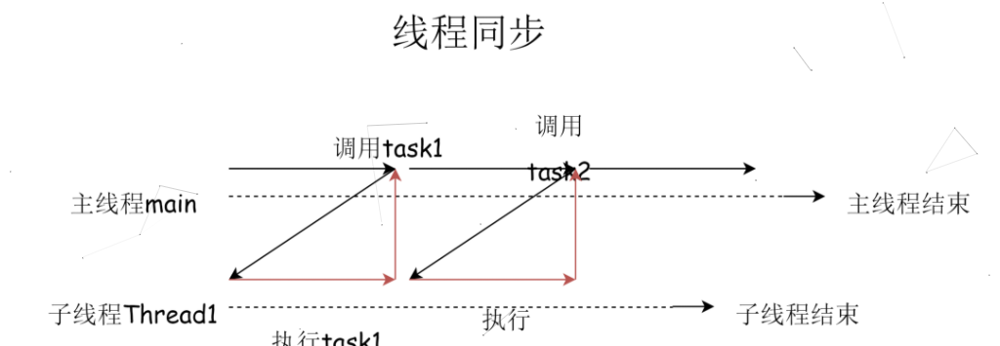

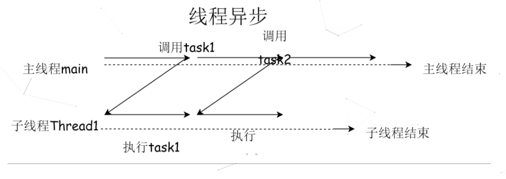

##### Lock接口

JDK1.5 加入的，显示定义，结构更加灵活；提供了很多实用性方法，功能更加强大，新性能更加优越。

void lock(): 获取锁，如果锁被占用，当前线程则进入等待状态

boolean tryLock() : 尝试获取锁（成功返回true，失败返回false，不阻塞）

void unlock()：释放锁

##### 重入锁

ReentrantLock： Lock接口的实现类，前面TestLock.java已经用过了。

重入锁指的是一个线程拿到该锁后，还可以再次成功获取，而不会因为该锁已经被持有（尽管是自己所持有）而陷入等待状态（死锁）。synchronized也是可重入锁。

##### 读写锁

ReentrantReadWriteLock：

1. 一种支持一写多读的同步锁，读写分离，可以分别分配读锁和写锁
2. 支持多次分配读锁，使多个读操作可以并发执行

互斥规则：

写——写：互斥，一个线程在写的同时其他线程会被阻塞

读——写：互斥，读的时候不能写，写的时候不能读。

读——读：不互斥，不阻塞

在读操作远远高于写操作的环境中，可以保证线程安全的情况下，提高运行效率。

##### 线程安全的数据结构

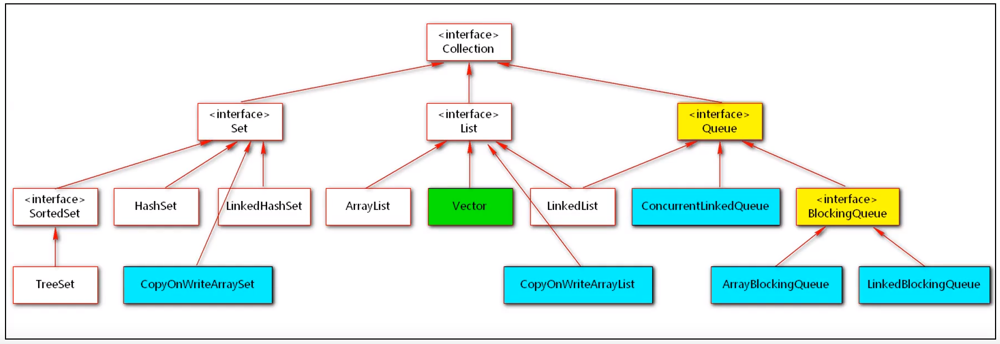

